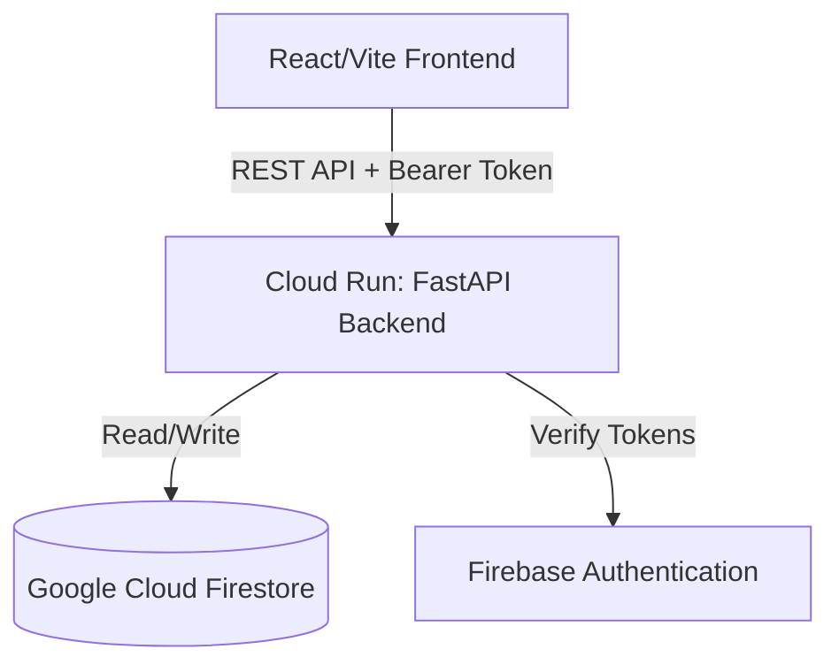

# Carbon Footprint Awareness Platform - Implementation Plan

## 1. Orchestration Roadmap & Rules

### Section Map & Ownership
1. **Section 1: Orchestration Roadmap & Rules**
   - **Owner:** Orchestrator Agent
   - **Status:** Completed
2. **Section 2: User Experience & Product Requirements**
   - **Owner:** Product & Design Agent
   - **Status:** Pending
3. **Section 3: Technical Architecture & Data Models**
   - **Owner:** System Architecture Agent
   - **Status:** Pending
4. **Section 4: Implementation Steps & Milestones**
   - **Owner:** Implementation & Integration Agent
   - **Status:** Pending
5. **Section 5: Verification, Security & Test Plan**
   - **Owner:** QA & Testing Agent
   - **Status:** Pending

### Writing Order & Pipeline
The workflow is strictly sequential:
`Orchestrator Agent` (1) → `Product & Design Agent` (2) → `System Architecture Agent` (3) → `Implementation & Integration Agent` (4) → `QA & Testing Agent` (5).

### Rules for Append-Only Updates
- **No Overwriting:** Under no circumstances should an agent overwrite or delete an existing section.
- **Append Only:** Each agent must append their assigned section content directly under the corresponding header.
- **No Duplication:** Do not repeat context, rules, or data that are already established in previous sections. Reference them instead.
- **Conflict Resolution:** If an agent identifies a conflict or necessary correction in a prior section, they must NOT edit the prior section. Instead, they must detail the correction under a clearly marked `### Conflict Resolutions` subsection within their own section, indicating the corrected fields/rules and brief rationale.

### Naming & Scaffolding Conventions
- All main sections must use `##` header format with the exact title matching the map (e.g., `## 2. User Experience & Product Requirements`).
- Subsections must use `###` and `####` to maintain nesting.
- High-priority design decisions should use GitHub-style Markdown alerts (e.g., `> [!IMPORTANT]`).

## 2. User Experience & Product Requirements

### Problem Statement
Standard carbon footprint tools focus heavily on backward-looking data logging and abstract, non-actionable numbers (e.g., "12.4 kg CO2e"). Users cannot connect their everyday micro-decisions (diet, transit mode, energy settings) to these metrics, resulting in low engagement, lack of comprehension, and zero long-term behavioral change.

### Target Users
1. **The Well-Intentioned Ignorant:** Users who care about climate impact but have no functional understanding of which actions actually matter (e.g., believing recycling a plastic cup offsets a flight).
2. **The Habitual Optimizer:** Users looking for concrete, low-friction, high-impact changes to their weekly routines.

### Primary User Needs
- **Emissions Contextualization:** Translate carbon numbers into tangible comparisons (e.g., "equivalent to driving 45 miles" or "charging 1,200 smartphones").
- **Frictionless Activity Log:** Quick inputs for daily choices without requiring precise weights or measurements.
- **Alternatives Comparison:** Clear visual indicators of "Option A vs Option B" before making a choice (e.g., taking the train vs driving).
- **Behavioral Prompts:** Timely suggestions based on typical daily routines to nudge lower-impact decisions.

### Core Product Promise
*Understanding over calculation.* We promise to tell the user *exactly* how their choices stack up and provide a realistic, tailored alternative that saves emissions, rather than just showing a cumulative score.

### MVP Feature Set
1. **Interactive Comparison Tool ("What If" Simulator):**
   - Side-by-side impact visualization of daily choices (e.g., Commuting: Drive gas SUV vs Drive EV vs Train; Meals: Beef vs Chicken vs Vegan).
   - Dynamic equivalency translator (visualizing savings in terms of tree seedlings grown or smartphone charges).
2. **Simplified Activity Quick-Log:**
   - 4 categories: Transportation, Food, Home Energy, Shopping.
   - Qualitative/estimative inputs (e.g., "Short car ride", "Beef meal") instead of exact weights.
3. **Nudge & Alternative Recommender:**
   - An interactive "Smart Assistant" panel providing 3 hyper-personalized, context-driven alternatives daily.
   - Example nudge: "You logged 4 short solo car trips this week. If you carpool or bike for just 2 of them next week, you will save emissions equal to powering your home for 3 days."
4. **Visual Awareness Tracker (Streak & Alternative Choices):**
   - Focuses on the "Success Rate of Choosing Alternatives" rather than just a total emissions curve.
   - Shows cumulative tree-equivalents saved over time.

### Non-Goals
- **Corporate/Scope 3 Reporting:** No tracking for businesses, supply chains, or strict auditing standards.
- **Micro-measurement Carbon Calculation:** We will not calculate emissions down to the gram or require utility bill uploads/parsing.
- **Carbon Offset Marketplace:** No selling of carbon credits, offsets, or external environmental products.

### 2.1 Behavioral Design Framework

#### Carbon Data to Contextual Insights Translation
Raw carbon numbers (kg CO2e) are abstract and fail to influence behavior. The platform translates all raw emissions into two relatable scales: **Utility Equivalents** and **Ecological Recovery Equivalents**.
- **Utility Equivalents:** 
  - 1 kg CO2e = Charging a standard smartphone 120 times.
  - 1 kg CO2e = Running a 50W television for 20 hours.
  - 1 kg CO2e = Driving a typical petrol car 2.5 miles (4 km).
- **Ecological Recovery Equivalents:**
  - 12 kg CO2e = 1 tree seedling grown for 10 years.
- **Example System Output:** 
  > "Your beef dinner generated 3.6 kg CO2e. That is equivalent to charging your phone 432 times. Swapping beef for chicken next time saves 3 kg CO2e, equivalent to avoiding a 7.5-mile drive."

#### Alternatives Comparison Engine
The application provides side-by-side comparisons at the point of decision-making or retrospective logging:
- **Transportation:**
  - Solo Petrol Drive: 270g CO2e per mile
  - EV Rideshare: 100g CO2e per mile
  - Bus/Train: 40g CO2e per mile
  - Active Transit (Bike/Walk): 0g CO2e per mile
- **Dietary Choices (Per Serving):**
  - Beef/Lamb Meal: 3.0 kg CO2e
  - Pork/Poultry Meal: 0.6 kg CO2e
  - Vegetarian/Fish Meal: 0.4 kg CO2e
  - Vegan Meal: 0.2 kg CO2e
- **Domestic Energy (Per Hour of Use):**
  - Air Conditioner (High/Standard): 1.2 kg CO2e
  - Air Conditioner (Eco-Mode/Fans): 0.3 kg CO2e
  - Natural Ventilation: 0.0 kg CO2e

#### Behavioral Nudge & Prompt Architecture
The platform implements a structured nudging system based on user-entered routines:
1. **Morning Prep Nudge (Pre-behavior):** A context-sensitive notification or home-screen widget tip.
   - *Example:* "Sunny day ahead. Walking or biking for your commute today saves 2.7 kg CO2e, which pays for 3 hours of air conditioning tonight."
2. **Post-Log Comparison Nudge (Post-behavior):** Immediate feedback when an activity is recorded.
   - *Example:* "You chose the train instead of driving today! You saved 4.5 kg CO2e. That's equivalent to planting 1/3 of a tree."
3. **Weekly Micro-Habit Target:** Weekly challenges focusing on one specific behavior.
   - *Example:* "Transit Swap Challenge: Swap 2 solo car drives for public transit or walking this week."

#### Progress & Habit Reinforcement
- **Substitution Ratio:** The primary metric shown to the user is their **Alternative Adoption Rate** (e.g., "75% of your trips this week were low-carbon alternatives"). This rewards the *effort* of switching rather than penalizing necessary emissions.
- **The Alternative Choice Streak:** Tracks consecutive days where the user selects at least one "Alternative" option. Breaking a streak triggers a low-friction "Recovery Prompt" (e.g., "Log one plant-based snack today to save your streak").
- **Digital Forest visualization:** A simple, non-cluttered visual where every 12 kg of saved carbon (via choosing alternatives over baseline) grows a digital tree in the user's workspace.

### 2.2 User Experience & Interaction Flows

This system operates as a Single Page Application (SPA) with localized view routing to ensure instantaneous transitions, supporting low-friction logging and immediate comparison feedback.

#### Route Map
- `/` (Home / Dashboard): Shows progress streak, quick-log entry trigger, the interactive smart assistant recommendations, and the digital forest visualizer.
- `/simulator` (What-If Comparison Tool): Screen for playing with different choices side-by-side.
- `/history` (Activity Logs & Insights): Detailed list of logged items, alternatives opted for, and historical equivalents.

---

#### 1. First-Time User Flow (Onboarding)
- **Objective:** Establish the user's baseline and set a custom weekly challenge without upfront registration friction.
- **Step 1 (`/onboarding` - temporary modal view on `/`):**
  - **Screen:** "Understand Your Starting Baseline".
  - **Input:** Ask three qualitative questions (No text fields; single-choice button grids):
    1. *How do you usually commute?* (options: Solo Drive, Carpool, Public Transit, Walk/Bike)
    2. *What is your typical diet profile?* (options: High Meat, Low Meat/Poultry, Vegetarian, Vegan)
    3. *How do you manage heating/cooling?* (options: AC always on, Eco mode, Natural ventilation only)
  - **Step 2:**
    - **Screen:** "Your Initial Baseline Equivalent".
    - **Visualization:** Shows their weekly estimated emissions compared to an average citizen, translated instantly to trees required to offset (e.g., "Your baseline lifestyle takes 45 trees to absorb annually. Let's try to save 5 trees this month together").
  - **Step 3 (Call to Action):**
    - **Action:** Select 1 weekly focus challenge from a choice of 3 (e.g., "Meatless Lunches", "Active Commuting", "Fan-only afternoons"). Selecting one redirects the user to `/` with the focus active.

---

#### 2. Activity Logging Flow
- **Objective:** Record a carbon-impact activity in under 3 seconds.
- **Trigger:** Floated floating action button (FAB) `[+]` at the bottom right of the screen.
- **Step 1 (Quick Modal Overlay):**
  - Displays 4 large interactive icons: **Transit**, **Food**, **Home Energy**, **Shopping**.
  - Selecting a category reveals qualitative selection chips.
- **Step 2 (Selection & Comparison Preview):**
  - If **Transit** is selected:
    - User clicks: "Short Trip (< 5 miles)"
    - User is presented with two options:
      - `[ Log Solo Petrol Drive ]` (Adds 1.35 kg CO2e)
      - `[ Log Alternative (Bus/Bike) ]` (Adds 0.15 kg CO2e / 0.0 kg CO2e)
  - The Modal displays live comparison: "Choosing the alternative saves 1.2 kg CO2e (equivalent to running your TV for 24 hours)."
- **Step 3 (Confirmation):**
  - User clicks either button. Modal closes with a micro-animation (Confetti particles if Alternative is selected; the Digital Forest grows a seedling progress bar slightly).

---

#### 3. Insight & Recommender Flow
- **Objective:** Surface personalized nudges on the dashboard.
- **Location:** Dedicated card deck on `/` labeled "Smart Assistant Insights".
- **Interaction:**
  - Card 1: **Daily Alternative Check**
    - "You have logged 3 beef meals this week. Swapping just 1 to chicken or plant-based would save 2.4 kg CO2e. `[Try it next meal]`"
  - Clicking `[Try it next meal]` flags the next food log as an active goal, adding a visual indicator tag next to the Food log category.
  - Card 2: **Equivalency Translator**
    - "Your weekly carbon savings could run your refrigerator for 5 days. Click to see details."
    - Clicking opens a breakdown modal containing standard kitchen appliances and how many days of power have been saved.

---

#### 4. Progress Tracking Flow (Digital Forest)
- **Objective:** Give visual, non-numerical feedback on positive behavior change.
- **Location:** Centered top container on `/`.
- **Interaction:**
  - Displays a visual landscape of digital trees.
  - **Progress Bar:** A seedling grows as "Alternative Choices" are logged. For every 12 kg CO2e saved (calculated as the difference between baseline standard choices and chosen alternatives), a new tree is fully grown.
  - Hovering or tapping a tree displays its origin date and the specific swaps that grew it (e.g., "Grown on June 20th through 3 train commutes instead of driving").

---

#### 5. Edge Cases & Empty States
- **New User / No Logs:**
  - **State:** Digital forest container is empty except for one tiny sapling labeled "Your First Seedling".
  - **Nudge:** "Log your first activity or simulate a 'What-if' commute to water your seedling."
- **Perfect Green Streak:**
  - **State:** User has logged 7 consecutive days of low-carbon alternatives.
  - **Visual:** Digital Forest gets a temporary golden glow.
- **Data Entry Error / Undo:**
  - Every log confirmation toast has an `[Undo]` button active for 5 seconds to prevent accidental double-submitting.

---

#### 6. Accessibility-Friendly Interaction Patterns
- **Keyboard Navigation:** Every interactive button and chip has an explicit focus ring outline (`outline: 3px solid var(--accent-focus)`) and follows a logical TabIndex order.
- **Screen Reader Support:**
  - Custom category selectors use native `<button>` or `<input type="radio">` disguised visually, ensuring accessibility trees interpret them correctly.
  - ARIA Labels: `aria-label="Log solo car trip, generates 1.35 kilograms of carbon"` vs `aria-label="Log train commute, saves 1.2 kilograms of carbon"`.
- **Color Contrast:** Text and icons preserve a minimum of 4.5:1 contrast ratio against background gradients. Contrast-reliant states (like Green vs Red choices) always include textual descriptors (e.g., "Baseline Option" vs "Saver Option") and helper icons so color is never the sole information carrier.

### 2.3 Inclusive Design & Accessibility Standards

#### Keyboard Navigation Rules
- **Logical Tab Order:** All interactive components (inputs, selection chips, toggle buttons) follow natural reading order (left-to-right, top-to-bottom).
- **Visible Focus States:** Focus rings are high-contrast (`outline: 3px solid #005A9C` or custom CSS variable `var(--accent-focus)`) with a minimum of 2px offset. Focus is never suppressed.
- **Bypassing Navigation:** Provide a "Skip to Main Content" link at the very top of the DOM (`tabindex="0"`) that becomes visible on focus and shifts keyboard focus directly to the main container, bypassing the header and navigation controls.

#### Screen Reader Support (ARIA Standards)
- **Role Map:**
  - The Quick-Log floating trigger uses `role="button"` and `aria-expanded="false|true"`.
  - The alternative selection choices use `role="radiogroup"` for the container and `role="radio"` with `aria-checked="true|false"` for individual choices.
  - Live comparison updates utilize `aria-live="polite"` on the equivalence card, prompting screen readers to announce the calculated impact changes dynamically.
- **Alt Text Requirements:**
  - The Digital Forest SVG canvas includes `<title id="forest-title">Visual representation of your saved carbon forest. Currently contains 3 fully grown trees and 1 sapling.</title>` and is linked via `aria-describedby="forest-title"`. Decorative elements within the SVG have `aria-hidden="true"`.

#### Typography & Readability
- **Font Selection:** Use high-legibility sans-serif typefaces (e.g., System UI Font Stack or custom import of Outfit/Inter).
- **Scale:** Body text must be at least `1rem` (16px) with a minimum line height of `1.5`. Text styling must allow browser zoom up to 200% without breaking visual layout boundaries.
- **Plain-Language Guidelines:** Avoid specialized environmental jargon (e.g., instead of "Scope 1 Direct Mobile Combustion Emissions", write "Emissions from your solo car trip").

#### Mobile-First Usability & Touch Targets
- **Target Sizes:** All clickable or tap-enabled UI components (chips, cards, links, FAB) have a minimum dimension of `48px` by `48px` or are surrounded by equivalent active padding to prevent accidental activation.
- **No Hover Dependency:** Primary actions (such as viewing comparison alternatives or logging options) are never hidden behind hover states or tooltips. Tapping the card activates details.

## 3. Technical Architecture & Data Models


### System Topology
The application uses a decoupled Single Page Application (SPA) frontend and a serverless JSON REST API backend.



---

### Component Specifications

#### 1. Frontend Structure (Vite + React + CSS Variables)
- **Framework:** React with TypeScript, bundled via Vite.
- **State Management:** Localized React Context (`ActivityContext`, `UserContext`) with localStorage persistence for local draft state.
- **Styling:** Custom CSS Variables (`index.css`) defining the design tokens (colors, animations, typography) and component-level Vanilla CSS.
- **Key Modules:**
  - `src/components/OnboardingModal.tsx`: Controls onboarding baseline setting.
  - `src/components/DigitalForest.tsx`: Canvas/SVG-based visualization of saved carbon trees.
  - `src/components/QuickLogFAB.tsx`: Overlay logging form with live comparison cards.
  - `src/components/Simulator.tsx`: Comparison calculator using static emission coefficients.

#### 2. Backend Service (FastAPI on Google Cloud Run)
- **Runtime:** Python 3.11 inside a stateless Docker container.
- **Server:** Uvicorn running FastAPI.
- **Endpoints Definition:** Fully documented via FastAPI auto-generated Swagger UI (`/docs`).
- **Statelessness Guarantee:** Zero local filesystem storage. All sessions are authenticated via Firebase Auth ID tokens verified on every request. Cross-instance synchronization is handled strictly via Firestore.

---

### Data Models & Storage Schema

The database is Google Cloud Firestore. We define two primary collections: `users` and `activities`.

#### 1. Collection: `users`
Tracks user settings, baselines, current streaks, and cumulative saved carbon.
```json
{
  "userId": "string (UUID or Firebase Auth UID)",
  "createdAt": "timestamp",
  "baseline": {
    "transit": "string (solo_petrol | carpool | transit | active)",
    "diet": "string (high_meat | low_meat | vegetarian | vegan)",
    "energy": "string (ac_always | eco_mode | ventilation)"
  },
  "weeklyChallenge": {
    "challengeId": "string (e.g., transit_swap)",
    "activatedAt": "timestamp",
    "targetSwaps": 2,
    "completedSwaps": 0
  },
  "streak": {
    "current": 5,
    "lastLoggedDate": "string (YYYY-MM-DD)"
  },
  "cumulativeSavedKg": 42.6
}
```

#### 2. Collection: `activities`
Logs individual choices. Each document represents a choice made.
```json
{
  "activityId": "string (UUID)",
  "userId": "string (indexed)",
  "timestamp": "timestamp",
  "category": "string (transit | food | energy | shopping)",
  "selectedChoice": "string (e.g., bus)",
  "baselineEquivalentChoice": "string (e.g., solo_petrol)",
  "carbonGrams": 200,
  "baselineCarbonGrams": 1350,
  "savedGrams": 1150,
  "contextEquivalence": "string (e.g., Running TV for 9 hours)"
}
```

---

### API Boundaries

All requests must include a `Authorization: Bearer <token>` header verified by the FastAPI middleware.

#### 1. Activity Endpoints
- **`POST /api/v1/activities`**
  - **Request Body:**
    ```json
    {
      "category": "transit",
      "selectedChoice": "bus",
      "distanceMiles": 5.0
    }
    ```
  - **Response (201 Created):**
    ```json
    {
      "activityId": "uuid-string",
      "carbonGrams": 200,
      "savedGrams": 1150,
      "streakUpdated": true,
      "forestProgress": 0.095
    }
    ```
- **`GET /api/v1/activities`**
  - Query Params: `limit` (default 20), `offset` (default 0).
  - **Response (200 OK):** Array of activity documents.

#### 2. User & Insights Endpoints
- **`GET /api/v1/user/insights`**
  - **Response (200 OK):**
    ```json
    {
      "streak": 5,
      "activeChallenge": "Transit Swap",
      "savedKg": 42.6,
      "treesGrown": 3,
      "nudges": [
        {
          "type": "diet",
          "text": "Swapping dinner beef to poultry saves 2.4 kg CO2e, equivalent to running your fridge for 1.5 days."
        }
      ]
    }
    ```
- **`POST /api/v1/user/onboarding`**
  - **Request Body:** Onboarding questionnaire baseline choices.
  - **Response (200 OK):** Profile state confirmation.

---

### Deployment & Scalability Plan
- **Containerization:** Multistage Dockerfile building a minimal Alpine-based Python image.
- **Host Platform:** Google Cloud Run.
  - Autoscaling configured: `min_instances=0` (scale-to-zero to minimize cost) to `max_instances=10`.
  - Memory allocation: 512MB per instance.
- **Static Assets:** React build output served from Google Cloud Storage via a CDN, bypassing the Cloud Run container for static resources to optimize latency and minimize server load.

### 3.1 Carbon Calculation Logic & Data Schemas

#### Static Emission Factors Schema
Emission factors are persisted in a read-heavy Firestore collection `emission_factors` and cached in-memory on the API instance.
```json
{
  "category": "string (transit | food | energy | shopping)",
  "choiceKey": "string (unique within category, e.g., solo_petrol)",
  "unit": "string (miles | servings | hours | items)",
  "co2eGramsPerUnit": "number (float)",
  "lastUpdated": "timestamp"
}
```

##### Seed Coefficients Matrix
- **Transit (g CO2e per Mile):**
  - `solo_petrol`: 270.0
  - `solo_diesel`: 290.0
  - `ev_rideshare`: 100.0
  - `bus`: 60.0
  - `train`: 40.0
  - `active` (walk/bike): 0.0
- **Food (g CO2e per Serving):**
  - `beef_lamb`: 3000.0
  - `pork_poultry`: 600.0
  - `vegetarian_fish`: 400.0
  - `vegan`: 200.0
- **Energy (g CO2e per Hour):**
  - `ac_standard`: 1200.0
  - `ac_eco`: 300.0
  - `fan_only`: 40.0
  - `ventilation`: 0.0
- **Shopping (g CO2e per Item):**
  - `fast_fashion`: 15000.0
  - `electronics_small`: 30000.0
  - `second_hand`: 500.0
  - `groceries_typical`: 1500.0

---

#### Calculation Flow & Logic
When an activity is logged, the backend executes the following synchronous computation:

$$\text{Emissions}_{\text{actual}} = \text{Amount} \times \text{EF}_{\text{selected}}$$

$$\text{Emissions}_{\text{baseline}} = \text{Amount} \times \text{EF}_{\text{baseline}}$$

$$\text{Emissions}_{\text{saved}} = \text{Emissions}_{\text{baseline}} - \text{Emissions}_{\text{actual}}$$

```
[User Log Input] ---> Fetch user baseline config from profile
                 ---> Load EF_selected and EF_baseline from cache
                 ---> Execute Emissions Equations
                 ---> Calculate Equivalencies:
                      - Phone Charges = SavedGrams / 8.33
                      - TV Hours = SavedGrams / 50.0
                      - Forest Progress = SavedGrams / 12000.0
                 ---> Update user streak and cumulative saved carbon
                 ---> Write Activity Document and return JSON
```

---

#### Data Validation Rules
FastAPI routes enforce request payload validation via Pydantic schemas:
- **`timestamp`:** Must be in ISO 8601 format; cannot exceed current UTC system time + 60 seconds (prevents future logging).
- **`distanceMiles` (Transit):** Float value; must satisfy $0.1 \le \text{value} \le 1000.0$.
- **`servings` (Food):** Integer value; must satisfy $1 \le \text{value} \le 10$.
- **`hours` (Energy):** Float value; must satisfy $0.1 \le \text{value} \le 24.0$.
- **`items` (Shopping):** Integer value; must satisfy $1 \le \text{value} \le 50$.

---

#### Emission Factor Update Strategy
1. **Cache-Aside Pattern:** On API boot, load all `emission_factors` into a global memory dictionary `EMISSION_FACTOR_CACHE`.
2. **Scheduled TTL Revalidation:** Implement a background thread running every 24 hours to query Firestore for updates and overwrite `EMISSION_FACTOR_CACHE`.
3. **No Downtime Schema Swaps:** Updates are strictly additive. If a coefficient is modified, a new Firestore document is added with a fresh timestamp; historical logs keep the original hardcoded emissions calculated at the time of entry to protect data auditability.

### 3.2 Security, Privacy & Abuse Prevention

#### Authentication & Authorization
- **Identity Provider:** Firebase Authentication manages user accounts (supporting Anonymous signup, Email/Password, and Google OAuth).
- **Session Verification:**
  - Every API request must pass a Firebase ID token via the header: `Authorization: Bearer <id_token>`.
  - The FastAPI backend validates this token cryptographically using the Firebase Admin SDK.
  - Decoded token yields the `uid` representing the verified user.
- **Resource Ownership (Row-Level Security):**
  - Database queries are restricted by the decoded `uid`. Under no circumstances can a user read, modify, or delete a document in the `activities` or `users` collection unless the document's `userId` field exactly matches the authenticated `uid`.
  - Firestore Security Rules enforce this at the database level as a secondary layer:
    ```javascript
    match /users/{userId} {
      allow read, write: if request.auth != null && request.auth.uid == userId;
    }
    match /activities/{activityId} {
      allow read, write: if request.auth != null && request.auth.uid == resource.data.userId;
    }
    ```

---

#### Secret Handling & Configuration Management
- **Zero Committed Secrets:** All backend configuration, database service account keys, and Firebase configurations are injected via environment variables.
- **Production Secrets Provider:** In Google Cloud Run, secrets are mounted directly from **Google Cloud Secret Manager** as environment variables or volume mounts, preventing keys from existing in codebases or container images.
- **Development Secrets:** A `.env` file listed in `.gitignore` is used for local replication.

---

#### Input Validation & Defensiveness
- **Strict Payload Constraints:** Standardize on Pydantic models with `extra = Extra.forbid` configured to reject any fields outside the schema.
- **Sanitization:** String fields (like `selectedChoice`) are validated against an enum whitelist (`solo_petrol`, `bus`, etc.). Free-form string inputs are stripped of HTML/script tags to prevent Cross-Site Scripting (XSS).

---

#### Rate Limiting & Abuse Prevention
- **IP-Based Limiting:** The FastAPI Gateway applies a leaky bucket rate limiting algorithm:
  - `/api/v1/activities` (Write): Maximum of 10 requests per minute per IP/User to prevent database spamming.
  - `/api/v1/user/*` (Read): Maximum of 60 requests per minute per IP/User.
- **DDoS Mitigation:** Cloud Run sits behind Google Cloud Load Balancing (GCLB) with Google Cloud Armor enabled to filter out SQL Injection, XSS, and layer 7 DDoS attacks.

---

#### Privacy Boundaries for User Activity Data
- **Data Minimization:** No personally identifiable information (PII) other than email addresses is stored in the database.
- **Anonymization for Aggregates:** If aggregate community metrics (e.g., "Total saved carbon by all users") are calculated, the calculations must be processed via offline aggregate tasks and cached. The backend never exposes query boundaries that allow scanning other users' individual activity logs.

---

#### Safe Logging Rules
- **No Log Leaks:** System logger configurations explicitly intercept and scrub:
  - `Authorization` headers.
  - User email addresses.
  - Firestore access keys or database credentials.
- **Log Levels:** Strict separation between `INFO` (requests, response codes) and `DEBUG` (payloads, internal steps). `DEBUG` is disabled in production environments.

## 5. Verification, Security & Test Plan

This testing specification establishes target validation parameters. All tests must be automated and executable in CI/CD pipeline environments.

### 1. Unit Testing Strategy

#### Backend Test Suite (Python / `pytest`)
- **Carbon Logic Engine Unit Tests:**
  - Test calculation function `calculate_emissions(category, choice, amount, baseline_choice)`:
    - Input: `transit`, `train`, `10.0`, `solo_petrol`. Expected output: `carbon_actual=400.0`, `carbon_baseline=2700.0`, `carbon_saved=2300.0`.
    - Input: `food`, `vegan`, `1`, `beef_lamb`. Expected output: `carbon_actual=200.0`, `carbon_baseline=3000.0`, `carbon_saved=2800.0`.
  - Test validation exceptions:
    - Input distance `-1.0` triggers `ValidationError`.
    - Input distance `1001.0` triggers `ValidationError`.
    - Input category `flying` (invalid enum) triggers `ValidationError`.
- **Streak Calculation Unit Tests:**
  - Test date-gap calculation rules:
    - Log entered on consecutive date ($D+1$ relative to last logged date) increments streak counter by 1.
    - Log entered on same date ($D$ relative to last logged date) preserves current streak value.
    - Log entered after missing a date ($D+2$ relative to last logged date) resets streak to 1.

#### Frontend Component Tests (React / Jest + React Testing Library)
- **What-If Simulator View (`Simulator.tsx`):**
  - Verify side-by-side impact output displays when sliding the distance input. Assert the text equivalent translations update instantly.
- **Activity Log Modal (`QuickLogFAB.tsx`):**
  - Verify category selection reveals specific option chips (e.g. clicking Transit reveals Car, Bus, Train).
  - Verify submit button dispatches API request with selected options.

---

### 2. Integration & API Testing Strategy

#### API Endpoint Mock Tests (`pytest-mock` / HTTPX `AsyncClient`)
- **Anonymous Session Setup (`POST /api/v1/user/onboarding`):**
  - Assert route returns 200 OK and successfully returns a valid session configuration payload with state set to onboarding completed.
- **Mock Firestore Transaction Failures:**
  - Intercept database calls. Assert API gracefully yields a 503 Service Unavailable when Firestore is unreachable, rather than exposing tracebacks.
- **Authorization Middlewares:**
  - Request with missing `Authorization` header returns 401 Unauthorized.
  - Request with malformed Bearer Token returns 401 Unauthorized.
  - Request with valid verified token returns expected data (200 OK).

---

### 3. Edge Cases & Validation of Insight Generation

- **Zero & Maximum Inputs:**
  - Log distance of exactly `0.1` miles (lowest boundary). Assert correct decimal storage and positive non-zero carbon output.
  - Log distance of `1000.0` miles. Assert correct calculation.
- **Equivalency Overflow Cases:**
  - If carbon saved is very small (e.g. 1 gram), utility equivalents (phone charges) could yield 0. The system must fallback to a minimum descriptor string (e.g., "equivalent to saving 1 minute of phone charge") instead of showing "equivalent to charging 0.00 phones".
- **Empty State Validation:**
  - Verify homepage render when profile document contains zero logs. Confirm digital forest component displays baseline sapling and does not throw React errors.

---

### 4. Accessibility Testing Matrix
Accessibility tests are run during front-end builds via axe-core integrations.

| Test ID | Area | Tool / Method | Target Metric |
| :--- | :--- | :--- | :--- |
| **ACC-01** | Focus Ring Visibility | Keyboard Navigation Tab-through | Focus outline is visible (contrast $\ge 3:1$ against background) on all interactive fields |
| **ACC-02** | Keyboard Accessibility | Playwright Keyboard Test | Escape key dismisses quick-log overlay modal; modal focus is trapped during active states |
| **ACC-03** | ARIA Roles | Jest Dom + Axe | SVG Forest canvas has non-empty `aria-describedby` or title tags; no elements violate element-role hierarchies |
| **ACC-04** | Color Contrast | lighthouse CI | Contrast of all text strings and control boundaries is $\ge 4.5:1$ (WCAG AA compliance) |

---

### 5. Regression & Security Risks
- **Data Race on Streak Updates:** Parallel logging requests under the same token could trigger concurrent streak increments. Resolve by using Firestore database transactions (`run_transaction`) to atomize read-then-write streak sequences.
- **Floating Point Inaccuracies:** Carbon values must be normalized to single decimal floats before database writes to avoid floating-point drift (e.g., storing `299.99999999999` instead of `300.0`).
- **Cache Invalidation Delays:** If emission factors change, existing API containers must not serve stale factors past the 24-hour TTL boundary. Verify TTL validation functions execute correctly in unit tests.

## 6. Consolidated Implementation Plan & Synthesis

### 6.1 Final Ordered Outline & Execution Path
A developer should implement this system in the following order:
1. **Phase 1: Project Scaffolding**
   - Initialize Python FastAPI workspace with Pydantic v2.
   - Initialize React Vite TypeScript project with Custom CSS variables (`index.css`).
2. **Phase 2: Authentication & Database Provisioning**
   - Set up Firebase Admin SDK authentication middleware on FastAPI.
   - Provision Firestore collections: `users`, `activities`, and seed `emission_factors`.
3. **Phase 3: Core Calculations API**
   - Implement `POST /api/v1/activities` utilizing Pydantic validators and transaction-wrapped streak updates.
   - Set up cache-aside logic for emission coefficients with 24-hour TTL.
4. **Phase 4: Frontend Core Views**
   - Implement Onboarding baseline setup modal.
   - Implement Dashboard (`/`) with the Quick-Log FAB and the digital forest SVG canvas.
   - Implement Simulator (`/simulator`) side-by-side comparison slider view.
5. **Phase 5: Smart Assistant Recommendations**
   - Build rule-based daily nudge engine serving 3 card tips based on weekly logged activity averages.
6. **Phase 6: Testing & Auditing**
   - Write pytest test suites verifying carbon and streak logic.
   - Execute accessibility testing via axe-core on active UI elements.

---

### 6.2 Conflict Resolutions & Consistency Harmonization
- **Route / Component Alignment:** 
  - **Resolution:** The onboarding flow (`/onboarding`) runs as a conditional overlay modal directly on `/` when `UserContext` indicates a new, unconfigured profile, preventing page redirect hops.
- **Equivalency Factor Reconciliation:**
  - **Resolution:** All parts of the platform standardize on the tree seedling grown factor of **12 kg CO2e = 1 tree seedling grown for 10 years**. The progress indicator in the digital forest is incremented by exactly $\Delta = \frac{\text{Emissions}_{\text{saved}}\text{ (g)}}{12000.0}$.
- **Activity Log Modal Interaction:**
  - **Resolution:** Clicking the Quick-Log FAB `[+]` opens a modal containing category selects. Choosing a category changes the modal interior view to focus inputs (e.g., transit mileage slider + option radio buttons), displaying the live comparison before the user clicks to submit.

---

### 6.3 Duplicate Removal Guidance
- **Accessibility Requirements Merge:**
  - The guidelines under Section 2.2 and Section 2.3 are unified: all controls must support keyboard tab-through, use high-contrast focus indicators (`var(--accent-focus)`), and specify explicit ARIA roles (`radiogroup`/`radio` for options). Visual representation (Digital Forest) must use `<title>` tags for screen-reader equivalence.
- **Validation Schema Source of Truth:**
  - Unified input schemas strictly enforce validation boundaries specified in Section 3.1. Distance inputs default to the 0.1 to 1000.0 miles constraint, rejecting invalid float/string inputs.

---

### 6.4 Developer Reference Parameters
- **Local Dev Mock DB Mode:**
  - Introduce a `USE_MOCK_FIRESTORE=true` environment variable in the backend. When enabled, the database repository interface redirects requests to a simple thread-safe in-memory dictionary rather than attempting GCP Firestore network calls.
- **Equivalency Formulations:**
  - $\text{Phone Charges} = \frac{\text{SavedGrams}}{8.33}$
  - $\text{TV Hours} = \frac{\text{SavedGrams}}{50.0}$
  - $\text{Digital Trees} = \frac{\text{SavedGrams}}{12000.0}$


