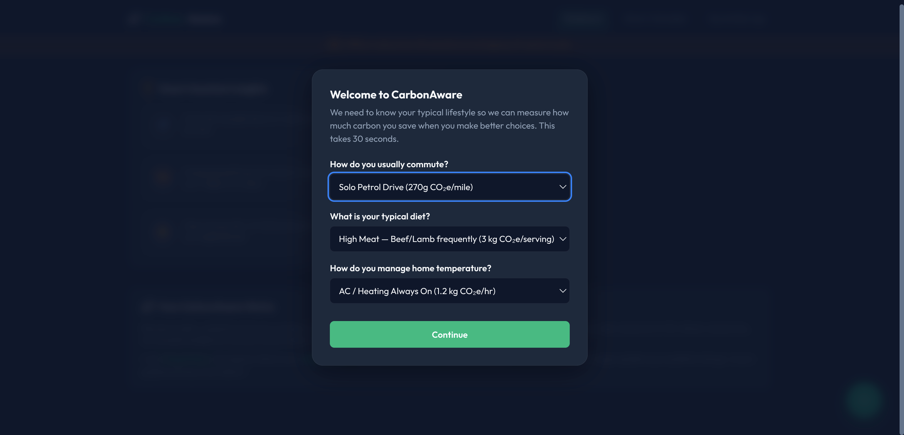
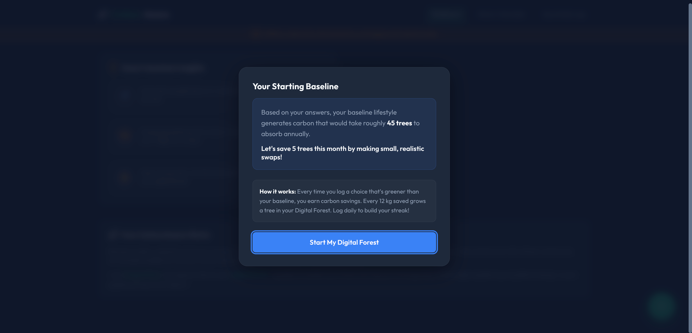
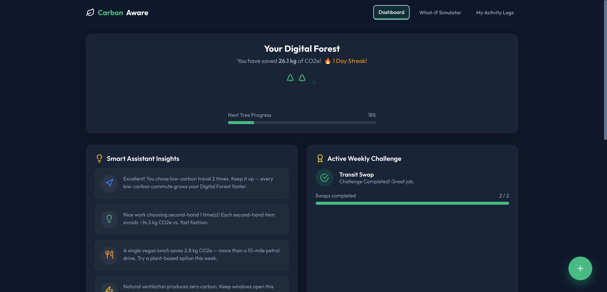
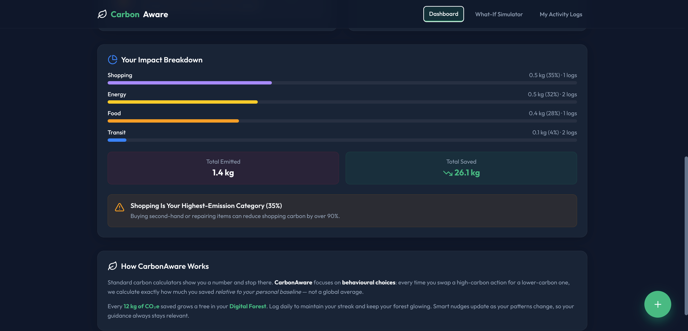
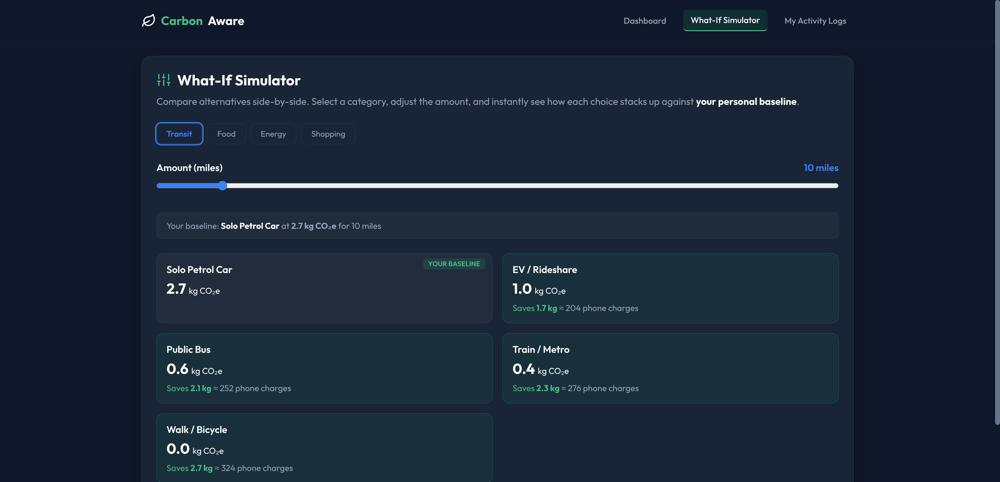
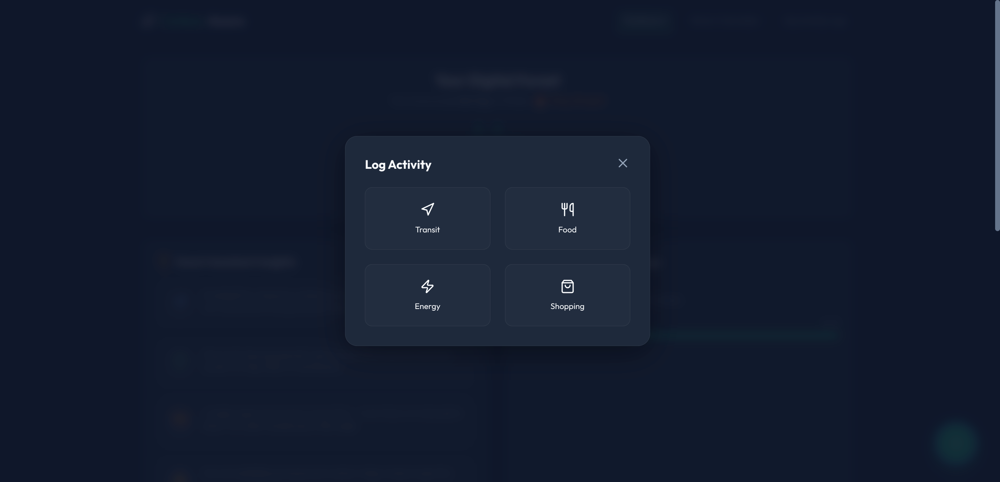
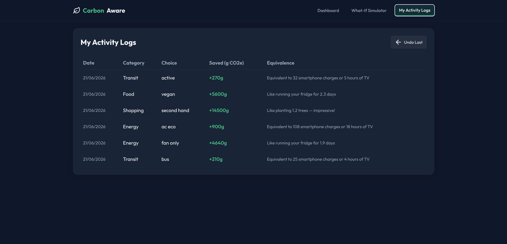

# 🍃 CarbonAware — Carbon Footprint & Behavioural Awareness Platform

[](https://fastapi.tiangolo.com/)
[](https://react.dev/)
[](LICENSE.txt)
[](backend/tests/)

> "Raw Carbon Data → Personal Understanding → Actionable Decisions → Behavior Change"

CarbonAware is a premium, web-based platform designed to shift the focus from abstract, static carbon calculations to **actionable behavioral changes** through dynamic context-aware nudging, personalized baseline comparisons, and interactive visualizations.

---

## 📖 Table of Contents

1. [Key Features](#-key-features)
2. [App Screenshots](#-app-screenshots)
3. [Technical Architecture](#%EF%B8%8F-technical-architecture)
4. [Getting Started & Local Setup](#-getting-started--local-setup)
   - [Linux](#1-linux)
   - [Windows](#2-windows)
   - [macOS](#3-macos)
   - [Docker Compose (Universal)](#4-docker-compose-universal)
5. [Running the Test Suite](#-running-the-test-suite)
6. [Project Structure](#-project-structure)
7. [Security & Compliance](#-security--compliance)
8. [Offline Resiliency & Fallback](#-offline-resiliency--fallback)
9. [API Reference](#-api-reference)
10. [Author & Contact](#-author--contact)
11. [License](#-license)

---

## 🌟 Key Features

| Feature | Description |
|---------|-------------|
| **Personalized Baseline Onboarding** | Establishes your transit, diet, and energy habits — all savings are measured relative to *your* lifestyle, not a generic average |
| **Digital Forest** | Every **12 kg of CO₂e** saved grows a tree in your digital forest. Visual progress tracking keeps motivation high |
| **Smart Nudge Engine** | 4-priority context-aware advisor that highlights your worst habits and celebrates your best choices |
| **What-If Simulator** | Interactive comparison tool spanning all 4 categories (Transit, Food, Energy, Shopping) with real-time equivalencies |
| **Impact Breakdown** | Analyses your logged activities to show per-category % breakdown and identifies your highest-emission area |
| **Weekly Challenge** | Gamified transit-swap challenge with progress tracking to build sustainable commuting habits |
| **Quick Activity Logging** | One-tap FAB button to log activities across transit, food, energy, and shopping categories |
| **Offline First Mode** | Full client-side calculations and localStorage persistence when backend is unreachable |

---

## 📸 App Screenshots

### Baseline Onboarding — Step 1 & Step 2
The interactive 2-step onboarding wizard determines your lifestyle profile across transport, food, and home heating categories to establish your customized emissions baseline.

| Step 1: Questionnaire | Step 2: Baseline Summary |
|:---:|:---:|
|  |  |

### Dashboard — Digital Forest, Smart Nudges & Weekly Challenge
The main dashboard shows your carbon savings, streak, tree growth progress, personalized nudge recommendations, and the active weekly challenge.



### Dashboard — How CarbonAware Works
Scroll down to see the explanation of the behavioural approach and how the platform differs from basic carbon calculators.



### What-If Simulator
Compare alternatives side-by-side across all 4 categories. Your personal baseline is tagged, and each option shows savings in real-world equivalencies (phone charges, car trips).



### Quick Log — Activity Logger
Tap the green `+` FAB to open the category selector. Choose Transit, Food, Energy, or Shopping, then fill in the details and log your activity.



### My Activity Logs
A complete history of all your logged activities with date, category, choice, carbon saved, and human-readable equivalencies.




---

## 🛠️ Technical Architecture

```
                      +-----------------------------+
                      |        User's Browser       |
                      +--------------+--------------+
                                     |
                +--------------------+--------------------+
                | (Online API calls)                      | (Offline local fallback)
                ▼                                         ▼
+-------------------------------+               +-------------------+
|    Vite React Frontend        |               |   localStorage    |
|  - TypeScript SPA             |               |  - Offline Cache  |
|  - Accessibility (WCAG)      |               |  - Mock Calc      |
+---------------+---------------+               +-------------------+
                |
                | REST API (JSON / CORS Secured)
                ▼
+-------------------------------+
|      FastAPI Backend          |
|  - Rate Limiter (SlowAPI)     |
|  - Nudge Engine (logic.py)    |
|  - Security Header Middleware |
+---------------+---------------+
                |
                ▼
+-------------------------------+
|      Repository Layer         |
|  - MockMemory (Dev / Default) |
|  - Google Firestore (Prod)    |
+-------------------------------+
```

**Tech Stack:**

| Layer | Technology |
|-------|-----------|
| Frontend | React 18, TypeScript, Vite 5, Lucide Icons |
| Backend | Python 3.11, FastAPI, Pydantic, SlowAPI |
| Database | In-memory mock (dev) / Google Firestore (prod) |
| Auth | Mock tokens (dev) / Firebase Admin SDK (prod) |
| Testing | Pytest (39 tests across 5 test files) |
| Containerization | Docker, Docker Compose |

---

## 💻 Getting Started & Local Setup

### Prerequisites

| Tool | Version |
|------|---------|
| **Python** | 3.10+ |
| **Node.js** | 18+ |
| **npm** | 9+ |

### 1. Linux

```bash
# Clone
git clone https://github.com/arsinghin/Carbon_Footprint_Awareness.git
cd Carbon_Footprint_Awareness

# Backend
python3 -m venv venv
source venv/bin/activate
pip install -r backend/requirements.txt
PYTHONPATH=backend uvicorn app.main:app --host 0.0.0.0 --port 8080 --reload
```
```bash
# Frontend (new terminal)
cd frontend
npm install
npm run dev
```

### 2. Windows

```powershell
# Clone
git clone https://github.com/arsinghin/Carbon_Footprint_Awareness.git
cd Carbon_Footprint_Awareness

# Backend (PowerShell)
python -m venv venv
.\venv\Scripts\Activate.ps1
pip install -r backend/requirements.txt
$env:PYTHONPATH="backend"
python -m uvicorn app.main:app --host 0.0.0.0 --port 8080 --reload
```
```powershell
# Frontend (new PowerShell window)
cd frontend
npm install
npm run dev
```

### 3. macOS

```bash
# Install prerequisites
brew install python node

# Clone
git clone https://github.com/arsinghin/Carbon_Footprint_Awareness.git
cd Carbon_Footprint_Awareness

# Backend
python3 -m venv venv
source venv/bin/activate
pip install -r backend/requirements.txt
PYTHONPATH=backend uvicorn app.main:app --host 0.0.0.0 --port 8080 --reload
```
```bash
# Frontend (new terminal)
cd frontend
npm install
npm run dev
```

### 4. Docker Compose (Universal)

```bash
docker-compose up --build
```

### Access Points

| Service | URL |
|---------|-----|
| Frontend Dashboard | http://localhost:5173 |
| Backend API | http://localhost:8080 |
| Swagger Docs | http://localhost:8080/docs |

---

## 🧪 Running the Test Suite

```bash
# Activate virtual environment first
source venv/bin/activate      # Linux / macOS
# or .\venv\Scripts\Activate.ps1  # Windows

# Run all 39 tests
PYTHONPATH=backend pytest backend/tests/ -v
```

**Test coverage spans:**
- `test_api.py` — Health check, auth enforcement, onboarding validation, activity logging
- `test_api_extended.py` — Security headers, insights structure, challenge updates, emission factors
- `test_logic.py` — Emission calculations, streak logic, nudge generation
- `test_logic_extended.py` — Equivalency tiers, shopping nudges, priority sorting, edge cases
- `test_database.py` — Deep merge correctness, activity ordering, pagination, user isolation

---

## 📁 Project Structure

```
Carbon_Footprint_Awareness/
├── backend/
│   ├── app/
│   │   ├── main.py          # FastAPI app, routes, security middleware
│   │   ├── logic.py         # Emission calculations, nudge engine, equivalencies
│   │   ├── schemas.py       # Pydantic request validation models
│   │   ├── database.py      # Repository layer (mock + Firestore)
│   │   ├── auth.py          # Token verification (mock + Firebase)
│   │   └── config.py        # Environment-based settings
│   ├── tests/               # 5 test files, 39 tests total
│   ├── Dockerfile
│   └── requirements.txt
├── frontend/
│   ├── src/
│   │   ├── App.tsx           # Main shell with routing and layout
│   │   ├── context/
│   │   │   └── AppContext.tsx # Global state, API calls, offline fallback
│   │   ├── components/
│   │   │   ├── DigitalForest.tsx    # Visual forest + progress bar
│   │   │   ├── NudgesPanel.tsx      # Smart assistant insights
│   │   │   ├── ChallengePanel.tsx   # Weekly challenge tracker
│   │   │   ├── ImpactSummary.tsx    # Category breakdown chart
│   │   │   ├── Simulator.tsx        # What-If comparison tool
│   │   │   ├── HistoryList.tsx      # Activity logs table
│   │   │   ├── QuickLogFAB.tsx      # Floating action button + log modal
│   │   │   └── OnboardingModal.tsx  # Baseline setup wizard
│   │   ├── index.css         # Design system (dark theme, glassmorphism)
│   │   └── main.tsx          # Entry point
│   ├── vercel.json           # Vercel rewrite rules for production
│   ├── vite.config.ts
│   └── package.json
├── docs/assets/              # Screenshots for documentation
├── docker-compose.yml
├── LICENSE.txt
├── NOTICE
└── .gitignore
```

---

## 🔒 Security & Compliance

| Practice | Implementation |
|----------|---------------|
| **Security Headers** | `X-Content-Type-Options: nosniff`, `X-Frame-Options: DENY`, `Referrer-Policy`, `Permissions-Policy` |
| **HSTS** | Enabled when `ENVIRONMENT=production` |
| **CORS** | Restricted to explicit origins via `CORS_ORIGINS` env var |
| **Rate Limiting** | Activity logging: 10/min, other endpoints: 60/min |
| **Input Validation** | All inputs validated via Pydantic with strict type checking and range enforcement |
| **No PII Logging** | Auth logs sanitized — no user IDs in production logs |
| **Swagger Disabled** | `/docs` and `/redoc` hidden in production mode |

---

## 🔌 Offline Resiliency & Fallback

- The React app monitors network state continuously
- If backend requests fail, a global `isOffline` alert banner appears
- All carbon calculations, equivalencies, and baseline comparisons run client-side using embedded emission coefficients
- Activity logs and user state persist via `localStorage`
- Data syncs automatically when connectivity is restored

---

## 📡 API Reference

| Method | Endpoint | Description | Auth |
|--------|----------|-------------|------|
| `GET` | `/health` | Health check | No |
| `POST` | `/api/v1/user/onboarding` | Set lifestyle baseline | Yes |
| `GET` | `/api/v1/user/insights` | Get streaks, nudges, challenge status | Yes |
| `POST` | `/api/v1/activities` | Log a carbon-saving activity | Yes |
| `GET` | `/api/v1/activities` | Fetch activity history (paginated) | Yes |
| `GET` | `/api/v1/emission_factors` | Get emission coefficients | No |

Full interactive documentation: http://localhost:8080/docs

---

## 👤 Author & Contact

**Alok Ranjan Singh**

| | |
|---|---|
| **LinkedIn** | [linkedin.com/in/arsinghin](https://www.linkedin.com/in/arsinghin) |
| **GitHub** | [@arsinghin](https://github.com/arsinghin) |

---

## 📄 License

This project is distributed under a custom **Proprietary Non-Commercial License**.  
Commercial distribution, modification for sale, or hosting as a paid SaaS is strictly prohibited.

See [LICENSE.txt](LICENSE.txt) and [NOTICE](NOTICE) for full terms.

Copyright © 2026 Alok Ranjan Singh. All rights reserved.
